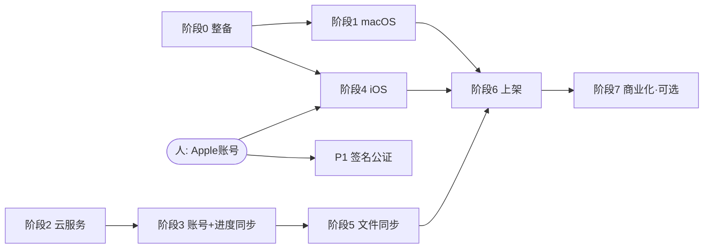

# Shelf 全平台执行计划（implementation_plan.md）

版本：v1.0（2026-07-08）
上游文档：《全平台开发文档.md》——本计划将其阶段 0–7 拆解为原子任务，每个任务可独立分派、独立验收。

## 使用说明

**任务格式**：每个任务一行 ID（如 `P3-5`），包含：内容、涉及文件、依赖、执行者、验收标准。

**执行者标记**：
- `[派]`——纯代码任务，验收标准明确，可分派给 Codex CLI 或 Claude 子代理，由主控（Claude）审查 diff + 跑验收命令
- `[主]`——需要跨端联调、架构决策或环境调试，由主控直接做
- `[人]`——只有你本人能做：注册账号、付款、控制台点按、提交审核

**依赖规则**：任务只依赖列出的 ID；同阶段内未互相依赖的任务可并行分派。
**原子标准**：每个 `[派]` 任务单次会话可完成（约 0.5–4 小时），产出一个可独立 review 的 diff。

---

## 依赖总览（阶段级）

**关键路径**：P0 → P2 → P3 → P4-6 → P6。
**最早可并行的三条线**：① P0/P1 客户端移植线；② P2 云端线（与 ① 完全无关，可同时开工）；③ H-1/H-2 账号申请线（有审核等待期，第一天就启动）。

---

## 前置任务（第一天就启动，都有外部等待期）

| ID | 任务 | 执行者 | 依赖 | 验收 |
|---|---|---|---|---|
| H-1 | 注册 Apple Developer Program（$99/年），完成 D-U-N-S/身份审核 | [人] | — | 能登录 App Store Connect |
| H-2 | 开通 Azure Trusted Signing（$9.99/月）+ 身份验证 | [人] | — | 拿到签名账户 endpoint |
| H-3 | 注册 Cloudflare 账号（R2）与 Supabase 账号 | [人] | — | 两个控制台可登录 |
| H-4 | 注册域名 + 指向静态站托管（Cloudflare Pages） | [人] | — | 域名可解析 |

---

## 阶段 0：项目整备（预计 3–5 天）

| ID | 任务 | 依赖 | 执行者 | 预估 |
|---|---|---|---|---|
| P0-1 | 消除 APPDATA 硬编码：`lib.rs:515` 改用 `app.path().app_data_dir()`；抽出 `data_dir()` 辅助函数，全部路径拼接走 `PathBuf` | — | [派] | 2h |
| P0-2 | 跨平台假设审计：全库搜索路径分隔符硬编码、`std::env::var`、Windows API 调用、`tauri.conf.json` 的 `$DATA` scope 展开行为；产出问题清单（不改码） | — | [派] | 1h |
| P0-3 | 快捷键抽象层：新建 `src/platform.ts`（`isMac`/`modKey`），Reader/Library 所有 `ctrlKey` 判断改为 `modKey` 判断，提示文案按平台显示 Ctrl/⌘ | — | [派] | 2h |
| P0-4 | 处理 P0-2 清单中的实改项（逐条小 diff） | P0-2 | [派] | 2h |
| P0-5 | 搭 `ci.yml`：PR 触发，`tsc --noEmit` + `cargo clippy -D warnings` + `cargo test` + windows/macos 双平台 debug 构建 | P0-1 | [派] | 2h |

**阶段验收（主控执行）**：CI 双平台绿灯；Windows 版手动回归（导入/阅读/进度/取词）无变化。

---

## 阶段 1：macOS 版（预计 1–2 周）

| ID | 任务 | 依赖 | 执行者 | 预估 |
|---|---|---|---|---|
| P1-1 | macOS 上 `tauri dev` 跑通：修编译/运行错误，确认书库目录落在 `~/Library/Application Support` | P0-1 | [主] | 4h |
| P1-2 | 打包配置：`bundle.targets` 增加 `dmg`/`app`，生成 icns 图标，确认 dict.db 资源随包 | P1-1 | [派] | 2h |
| P1-3 | 原生菜单栏：App 菜单（About/退出）、编辑菜单（复制粘贴，取词弹窗依赖）、视图菜单（单双页/缩放） | P1-1 | [派] | 3h |
| P1-4 | 红绿灯窗口按钮与顶栏布局适配（检查现有自绘顶栏是否遮挡） | P1-1 | [派] | 2h |
| P1-5 | 触控板手势：双指滚动翻页阈值、捏合缩放（`gesturestart/change` 或 wheel+ctrlKey 合成事件） | P1-1 | [派] | 3h |
| P1-6 | Cmd 快捷键接入 P0-3 抽象层并全量过一遍快捷键表 | P0-3, P1-1 | [派] | 1h |
| P1-7 | `release-desktop.yml`：tag 触发，macOS universal 构建 + codesign + notarytool 公证 + DMG；Windows NSIS + Trusted Signing 签名；上传 GitHub Release | P1-2, H-1, H-2 | [主] | 6h |
| P1-8 | 自动更新：接 `tauri-plugin-updater`，Release 附带 latest.json，双平台验证升级 | P1-7 | [派] | 4h |

**阶段验收**：Mac 上全流程可用；从官网 DMG 安装无 Gatekeeper 拦截；v+0.0.1 测试版可自动更新。

---

## 阶段 2：云服务 MVP（预计 2–3 周，可与阶段 1 并行）

| ID | 任务 | 依赖 | 执行者 | 预估 |
|---|---|---|---|---|
| P2-1 | 建 Supabase 项目 `shelf-dev`/`shelf-prod`；本地装 supabase CLI，`supabase init` 入仓库 | H-3 | [人]+[主] | 1h |
| P2-2 | 编写 migration SQL：`books`/`reading_progress`/`user_quota` 三表 + 全部 RLS 策略（照开发文档 §5.2），入 `supabase/migrations/` | P2-1 | [派] | 2h |
| P2-3 | RLS 策略测试：SQL 层验证 A 用户读不到 B 用户的行（pgTAP 或脚本断言） | P2-2 | [派] | 2h |
| P2-4 | Auth 配置：邮箱+密码开启；Google OAuth 应用；Sign in with Apple（Service ID，依赖 H-1） | P2-1, H-1 | [人]+[主] | 3h |
| P2-5 | 建 R2 bucket `shelf-dev`/`shelf-prod`，开服务端加密，创建 API token | H-3 | [人] | 1h |
| P2-6 | Edge Function `sign-url`：校验 JWT → 校验对象键前缀 = 本人 user_id → 配额检查（PUT 时）→ 返回预签名 URL；含单元测试 | P2-2, P2-5 | [派] | 4h |
| P2-7 | Edge Function `delete-account`：级联删 Postgres 行 + 清空 R2 前缀 + 删 auth 用户 | P2-6 | [派] | 3h |
| P2-8 | 本地 SQLite 迁移：schema_version 机制 + v2 迁移（books 增 `updated_at/deleted/synced_at/cloud_state` 列，新建 `sync_meta` 表，进度表增 `updated_at`） | — | [派] | 3h |
| P2-9 | 集成测试骨架：`supabase start` 本地栈 + 测试脚本（建用户→插行→RLS 验证→签 URL→模拟上传） | P2-3, P2-6 | [派] | 4h |

**阶段验收**：本地栈上集成测试全绿；dev 环境从零重建只需 `supabase db push` + 一个 setup 脚本。

---

## 阶段 3：账号 + 进度同步（预计 2–3 周）

| ID | 任务 | 依赖 | 执行者 | 预估 |
|---|---|---|---|---|
| P3-1 | Rust `SyncBackend` trait 定义（auth/push/pull/sign_url 接口）+ 数据结构（与云端 schema 对应的 serde 模型） | P2-2 | [派] | 2h |
| P3-2 | Supabase 后端实现：reqwest 封装 GoTrue（注册/登录/刷新/登出）+ PostgREST upsert/增量查询 | P3-1 | [派] | 4h |
| P3-3 | Token 安全存储：keyring crate（macOS/Win）+ iOS Keychain 路径验证；refresh token 自动续期 | P3-2 | [派] | 3h |
| P3-4 | SyncEngine 核心（纯逻辑，不碰网络）：push 变更集计算（`updated_at > synced_at`）、pull 合并（LWW + 墓碑 + 2 分钟窗口取大页码规则）、游标管理 | P2-8 | [派] | 4h |
| P3-5 | SyncEngine 单元测试：LWW 双向覆盖、墓碑传播、时钟偏移、离线积压追平、幂等重放——**全分支覆盖，本计划最高优先级测试** | P3-4 | [派] | 4h |
| P3-6 | SyncEngine 接线：tokio 后台任务，触发器（启动/翻页防抖 30s/书架变更/5min 心跳/网络恢复），失败退避重试 | P3-2, P3-4 | [主] | 4h |
| P3-7 | 登录/注册/账号页 UI：邮箱注册登录、OAuth 跳转、同步状态指示、登出、**删除账号入口**（调 P2-7） | P3-2 | [派] | 6h |
| P3-8 | 双端联调验收：Windows ↔ Mac 进度互通、离线追平、删书传播 | P3-6, P3-7, P1 全部 | [主] | 4h |

**阶段验收**：A 端翻页 B 端 1 分钟内对齐；飞行模式操作联网后追平；`cargo test` 同步模块全绿。

---

## 阶段 4：iOS / iPadOS + TestFlight（预计 3–4 周）

| ID | 任务 | 依赖 | 执行者 | 预估 |
|---|---|---|---|---|
| P4-1 | `tauri ios init` + 模拟器跑通 + 真机跑通（签名 profile 依赖 H-1）；rusqlite bundled 与 asset protocol 在 iOS 验证 | P0-1, H-1 | [主] | 6h |
| P4-2 | Reader 页面虚拟化：只保留可见页 ±1 的 Canvas，滚出即销毁（所有平台生效，桌面端同样受益） | — | [派] | 4h |
| P4-3 | 渲染分辨率预算：渲染尺寸 = 视口 × min(dpr,2)；缩放手势进行中用 CSS transform 拉伸、结束后重渲染；断言常驻位图 ≤3 页 | P4-2 | [派] | 4h |
| P4-4 | 触屏手势：滑动/点击两侧翻页、捏合缩放接 P4-3、长按取词（替代双击，接现有 WordPopup） | P4-1, P4-3 | [派] | 4h |
| P4-5 | 移动端布局：安全区 inset、点击目标 ≥44pt、书架网格响应式、iPhone 紧凑模式 | P4-1 | [派] | 4h |
| P4-6 | 文件导入：dialog 插件选择器验证 + Info.plist 声明 PDF 文档类型（文件 App"分享到 Shelf"入口）+ 导入落库走现有 SHA-256 流程 | P4-1 | [主] | 4h |
| P4-7 | 生命周期：进入后台立即持久化进度 + 触发 push；恢复前台触发 pull | P4-1, P3-6 | [派] | 2h |
| P4-8 | dict.db 首启动从 bundle 拷贝到 app_data（iOS 资源路径与桌面不同） | P4-1 | [派] | 2h |
| P4-9 | Instruments 内存压测：300 MB 扫描版 PDF 连续翻 50 页 + 反复缩放，峰值 < 600 MB、无终止 | P4-3, P4-4 | [主] | 3h |
| P4-10 | `release-ios.yml`：tauri ios build → ipa → fastlane pilot 上传 TestFlight | P4-1, H-1 | [主] | 4h |
| P4-11 | TestFlight 内测组建立、邀请外部测试员、收集反馈渠道 | P4-10 | [人] | 1h |

**阶段验收**：iPad/iPhone 真机全流程可用；三端进度互通；压测达标；朋友凭 TestFlight 链接可安装。

---

## 阶段 5：书籍文件同步（预计 1–2 周）

| ID | 任务 | 依赖 | 执行者 | 预估 |
|---|---|---|---|---|
| P5-1 | 上传队列（Rust）：入库后异步排队，>100 MB 走 R2 分片，断点续传，失败退避，单文件上限 500 MB | P2-6, P3-6 | [派] | 6h |
| P5-2 | 封面缩略图：入库时生成 480px JPEG（前端 Canvas 导出），随队上传 | P5-1 | [派] | 2h |
| P5-3 | 云书架：pull 时合并 remote 书目，书架区分显示（本地/云端角标），点开 remote 书 → 预签名 GET 下载 → SHA-256 校验 → 打开 | P5-1, P5-2 | [派] | 5h |
| P5-4 | 传输策略设置页：仅 Wi-Fi 开关（移动端）、配额已用/上限展示（读 user_quota）、手动"上传全部/仅元数据"模式 | P5-1 | [派] | 3h |
| P5-5 | 四端文件同步联调：新设备登录 → 书架浮现 → 按需下载 → 进度接续 | P5-3, P4 全部 | [主] | 3h |

**阶段验收**：新设备登录后 1 分钟内书架完整浮现；下载中断可续传；配额超限有明确提示且拒绝上传。

---

## 阶段 6：上架（预计 2–3 周，大量外部等待）

| ID | 任务 | 依赖 | 执行者 | 预估 |
|---|---|---|---|---|
| P6-1 | 官网落地页 + 隐私政策页（静态站，Cloudflare Pages） | H-4 | [派] | 4h |
| P6-2 | App Store 材料：截图（iPhone/iPad/Mac 各尺寸）、描述文案、隐私标签申报、审核演示账号、`ITSAppUsesNonExemptEncryption=false` | P4-11 | [主]+[人] | 4h |
| P6-3 | Mac App Store 变体：App Sandbox 开启 + entitlements 调整 + MAS 构建目标（与官网 DMG 并行双渠道） | P1-7 | [主] | 6h |
| P6-4 | Microsoft Store：msix 打包目标 + 商店材料 | P1-7 | [派] | 3h |
| P6-5 | 提交三个商店审核，跟进驳回意见 | P6-2, P6-3, P6-4 | [人] | — |

**阶段验收**：iOS/iPadOS/macOS App Store 与 Microsoft Store 上线；官网可下载直装版。

---

## 阶段 7：商业化（可选）

| ID | 任务 | 依赖 | 执行者 | 预估 |
|---|---|---|---|---|
| P7-1 | 加入 App Store 小型企业计划（15% 抽成） | P6-5 | [人] | — |
| P7-2 | iOS StoreKit 2 订阅（Pro 档）：Swift 插件桥接 + 收据校验 Edge Function + 写 user_quota.plan | P6-5 | [主] | 8h |
| P7-3 | 桌面端 Stripe/支付宝收银台（官网跳转式）+ webhook 写 plan | P6-5 | [派] | 6h |
| P7-4 | 配额升降级逻辑：降级超配额时只读不删，提示清理 | P7-2/P7-3 | [派] | 2h |

---

## 分派与验收协议（Codex / 子代理通用）

主控分派 `[派]` 任务时提供：任务 ID + 本文件中的任务描述 + 涉及文件的现状摘要 + 明确的完成定义。

每个 `[派]` 任务的通用验收流程（主控执行，缺一不可）：
1. `git diff` 逐行审查：改动范围不越界（只碰任务声明的文件）、风格与现有代码一致、无多余重构
2. `cargo clippy -D warnings && cargo test`（Rust 改动）/ `tsc --noEmit`（前端改动）
3. 跑该任务表格中的专属验收标准
4. 不达标 → 附具体失败原因打回重派；两轮不过 → 主控收回自己做

**里程碑检查点**（到达时暂停，向你汇报演示后再继续）：
- M1 = 阶段 1 完成（Mac 版可用）
- M2 = 阶段 3 完成（双端接着读）
- M3 = 阶段 4 完成（TestFlight 可分享朋友）
- M4 = 阶段 6 完成（商店上线）
